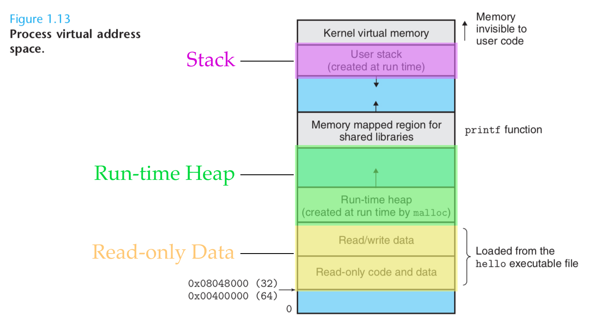

去年下半年在 CMU 最后一个学期的 Practicum 中，帮 Adobe 移植一个浏览器里的内存泄漏检测工具 BLeak 到 NodeJS，我们取名叫 [NLeak](https://github.com/nleak/nleak)，它将内存中连续几次的 Heap Snapshot 做比对，来找出内存泄漏的源头并标记在 source map 上，这个简单的 PoC 已经可以找出 NodeJS 一些基本的内存泄漏，但到实用的程度可谓任重道远。不管是发布近二十年的 C++ 老牌的内存检测工具 [Valgrind](https://en.wikipedia.org/wiki/Valgrind) 还是去年 Facebook 才开源的检测 JS 内存泄漏的 [memlab](https://github.com/facebook/memlab)，任何语言编写的程序，只要跑在冯诺依曼结构的计算机上，内存问题就是我们软件工程师永远绕不过的问题之一。

那相比于出了问题我们用工具去检测和补救，有没有什么工具是能帮助我们从源头上避免掉很多内存问题的呢？Rust 可能是现阶段一个不错的答案。

**为什么我们说 Rust 能编写出内存安全的应用？**

一聊到 Rust，我们提到的不是它在 bare metal 上的高并发性能；不是它的 portability，可以编译成不同平台的机器码，也可以编译成 WebAssembly；也不是它的开发效率，比 C, C++ 更易上手，bulletproof 的标准库，易用的工具链和活跃的开源社区。而是今天想聊聊的内存安全：

Rust 能够保证内存安全，它能避免很多 C, C++ 等语言常见的内存问题：内存泄漏，双重释放，垂悬指针，缓冲区溢出，未初始化的内存使用等等。同时，Rust 也提供了安全的标准库函数和宏，以帮助开发人员避免这些错误。而它内存安全的特性主要得益于三点设计：

1. **所有权和借用系统**：Rust 通过所有权和借用系统来管理内存，确保在编译时就能够检测到内存安全问题。
2. **生命周期**：Rust 引入了生命周期的概念，用于管理引用的有效性。生命周期描述了引用在程序中存在的时间范围，以确保引用不会超出它所引用的值的生命周期。这有助于避免引用非法或悬垂的值。
3. **零成本抽象**：Rust 的抽象机制允许程序员使用高层次的语言特性，同时不会牺牲性能。这是通过使用 Rust 的编译时代码生成和优化机制实现的，这些机制使得抽象可以被转化为高效的机器码。这种优化机制使得 Rust 可以提供内存安全的同时，也保持了与 C++ 等语言相当的性能。

这里面，所有权和借用系统是最重要的，也是这次要关注的，生命周期和零成本抽象我会在未来的博客中再聊。我将用几个例子来慢慢深入，来思考一下为什么 Rust 引入了所有权这个新概念，它又是如何来帮助解决上面的内存问题的。

# 一切由字符串聊起

## 被编译器嫌弃的我 😖

“Hey！为什么连最简单的字符串操作，都能被编译器骂得狗血淋头？” 可能很多刚刚接触 Rust 的人都会和我有样的感受，我们可以通过下面几个简单的例子，来看看 Rust 的所有权和其他语言有什么不同。

### 例子 1: 嘿！我只想更新下我的字符串而已

```c
fn main() {
    let word = "foo"; // you should add `mut` keyword here
    word = "bar"; // error[E0384]: cannot assign twice to immutable variable `str`
    println!("{}", word);
}
```

这是因为在 Rust 中定义一个变量时，默认情况下这个变量是 immutable 的，也就是说我们不能改变它的值。如果有需要，可以通过 `mut` 关键字来定义可变变量。所以上面应该修改成 `let mut word = "foo"`。

### 例子 2：嘿！我只想把两个字符串拼接起来而已

```c
fn main() {
    let s1 = "Hello";
    let s2 = " World!";
    hello = s1 + s2; // error[E0369]: cannot add `&str` to `&str`
    println!("{}", hello);
}
```

因为 `&str` 是放置于 Stack 上的切片引用，不支持 `+` 来拼接。如果你想要拼接两个字符串，可以将这个字符串转化成存放在 Heap 上的使用 `String` 类型：

```c
fn main() {
    let s1 = String::from("Hello");
    let s2 = String::from(" World!");
    let s3 = s1 + &s2; // Note: left of + must be String and right of + must be &str, but why? Let's talk about it later :)
    println!("{}", s3);
}
```

我们这里提到了 Rust 里非常重要的一个概念：切片 (Slice)，`&str`类型的变量 `s1` 就是一个切片，我们后面会更深入去理解它。

### 例子 3：嘿！我还想用之前的字符串，怎么就不行了？

```c
fn main() {
    let s1 = String::from("Hello");
    let s2 = String::from(" World!");
    let s3 = s1 + &s2;
    println!("{} {} {}", s1, s2, s3); // error[E0382]: borrow of moved value: `s1`
}
```

这里我们就得引入 Rust 中最重要的概念之一：所有权。当我们创建一个变量时，Rust 会为其分配内存，并通过所有权机制来管理这些内存。每个值都有一个被称为其 owner 的变量。当 owner 离开作用域时，它拥有的值将被释放。所有权和作用域是保证内存安全的关键所在。

`String` 是一个拥有所有权的类型 ，它包含指向实际字符串数据的指针、字符串长度和字符串容量。当我们在 Rust 中使用 `+` 运算符来连接两个字符串时，Rust 会将第一个字符串的所有权转移给运算符，产生一个新的 String 对象。这意味着我们不能再次访问第一个字符串，因为它的所有权已经被转移了。如果我们想要在操作后继续使用第一个字符串，我们可以使用 `clone()` 方法来创建一个新的 String，并在操作后使用它。

所以这里可以改成：

```c
fn main() {
    let s1 = String::from("Hello");
    let s2 = String::from(" World!");
    let s3 = s1.clone() + &s2;
    println!("{} {} {}", s1, s2, s3);
}
```

### 例子 4: 嘿！我的字符串传进一个函数后就被吃了？它是黑洞么！

```c
fn to_uppercase(s: String) -> String {
    return s.to_uppercase()
}

fn main() {
    let my_string = String::from("Hello World!");
    let my_uppercase_string = to_uppercase(my_string);
    println!("Original string: {}", my_string); // error[E0382]: borrow of moved value: `my_string`
    println!("Uppercase string: {}", my_uppercase_string);
}
```

这里也和上一个例子一样， `my_string` 的所有权在进入函数 `to_uppercase` 之后转移给了 `s`，而当 `s` 离开它的作用域时（也就是 `to_uppercase` 的最后一行的 `return`）， Rust 会认为 `s` 已使用完毕，并释放底层的内存。所以 Rust 在编译时就会提醒，`my_string` 的所有权已经被 `moved` 了，在调用完 `to_uppercase` 之后就不能再用了。被编译器骂多了之后，我倒觉得它变得贴心可爱起来，而且 `moved` 这个关键词也非常形象不是么？之前的所有权被移走了， `my_string`不是 My String 了。

那这里除了可以使用 `my_string.clone()` 以外，还可以传入一个引用 `&my_string`，来避免 `my_string` 的所有权被转移，这也就是另一个很重要的概念： 借用 （Borrowing）。

```c
fn to_uppercase(s: &str) -> String { // `s` is the reference of `my_string`
    return s.to_uppercase() // created a new String and return
}

fn main() {
    let my_string = String::from("Hello World!");
    let my_uppercase_string = to_uppercase(&my_string); // borrowing `my_string`
    println!("Original string: {}", my_string);
    println!("Uppercase string: {}", my_uppercase_string);
}
```

这几个简单的例子就包含了我们要聊到的几个基本概念：切片，引用和借用，所有权。

## 所有权机制

Rust 是一个没有运行时垃圾回收的语言，这保证了它能成为和 C / C++ 并肩的高效的系统级开发语言。但它又比 C / C++ 这种手动管理内存的语言更加安全，这背后的基础有两点：所有权系统和借用检查机制。

### 复习背景知识：Stack 和 Heap

因为我们的关注点在内存，所以在介绍所有权三原则之前我们可以简单复习一下 Stack 和 Heap 的概念。这里搬出我们的 CSAPP：



在大多数编程语言中，像 Java、C、C++ 等，原始数据类型的变量，函数调用的上写文等等会被存储在栈上，而其他类型的变量则会被存储在堆上。栈通常是编译器管理的一个大小固定的 LIFO 数据结构，因为里面的数据是连续存储，访问速度很快，就像通过 index 拿到数组里的数据一样。堆则是动态的数据结构，需要我们手动分配和释放，在运行时堆里面的数据不是连续存储同时大小不固定，所以需要通过指针来访问，速度比栈更慢，但同样这个特性也是优势，堆可以存储动态分配的数据，例如变长数组、字符串和复杂的数据结构，而且可以在程序运行时动态地分配和释放内存。

在 Rust 的世界里，编译器在编译时必须确定每个数据结构的大小，从而保证栈上分配内存时不发生溢出，Rust 采用了 “零成本抽象” 的编译技术来在编译时确定该类型的大小，我们未来再聊 Rust 的编译。

字符串类型 `&str` 和 `String` 就是非常典型的例子，`&str`表示一个字符串的切片，它是一个不可变的引用，通常存储在栈上。`String`表示一个可变的字符串，通常存储在堆上。`String`是一个拥有所有权的类型，它包含指向实际字符串数据的指针、字符串长度和字符串容量。

重新熟悉了栈和堆之后，这里最大的 takeaway 就是 Rust 不管是存在栈上的原始类型或者是存在堆上的可变类型，都会遵循所有权模型，各自的实现各有不同。我们接下来就终于可以来看看所有权到底是什么？

### 所有权三原则

1. 每一个值都有一个对应的变量作为它的所有者。
2. 在同一时间内，值**有且仅有一个**所有者。
3. 当所有者离开自己的**作用域(Scope)**时，它持有的值就会被**释放(Dropped)**。

```c
fn to_uppercase(s: String) -> String {
    return s.to_uppercase()
}

fn main() {
    let my_string = String::from("Hello World!");
    let my_uppercase_string = to_uppercase(my_string);
    println!("Uppercase string: {}", my_uppercase_string);
    println!("Original string: {}", my_string); // throw `moved` error
}
```

这三原则其实在之前的例子我们已经可以总结出来了，

- Rule #1：“Hello World!” 字符串会有对应的所有者，也就是 `my_string`
- Rule #2：execution context 进入到`to_uppercase` 之后，字符串的所有者变成了 `s`
- Rule #3：`s` 在离开自己的作用域的时候，它持有的值就会被释放。

其实就是这么简洁。那么问题来了，Rust 如何去帮我们释放内存的呢？

### 如何释放内存？堆上类型的 `Drop trait`

释放（Drop）的意思，其实是当前这个类型实现了 Drop trait （trait 是个新概念，我们可以姑且把它当成 Java 的 Interface），在变量的生命周期到尾声的时候，Rust 帮我们调用了 `drop` 函数来释放内存。比如下面 String 就会实现 Drop trait。（声明：此例子是 ChatGPT 生成的示例实现，非 [String 源码](https://github.com/rust-lang/rust/blob/master/library/alloc/src/string.rs)）

```c
pub trait Drop {
    fn drop(&mut self);
}

impl Drop for String {
    fn drop(&mut self) {
        unsafe {
            let ptr = self.as_mut_vec().as_mut_ptr();
            let len = self.len();
            std::mem::forget(self);
            std::alloc::dealloc(ptr, Layout::from_size_align_unchecked(len, 1));
        }
    }
}
```

在我们手动释放之前，我们不必担心内存泄漏。这种方式被称为 RAII（资源获取即初始化），它保证了在离开作用域时，所有的资源都会被释放。其实 C++ 也有 RAII，比如在一个 Class 的 deconstructor 阶段里关掉初始化时开启的 file descriptor 等等，但并不像 Rust 是在语言层面必须要实现 Drop trait 来保证所有权，相比之下 Rust 就严格得多。

除了 `Drop trait`, 还有 `Borrow trait` , `Deref trait` , `AsRef trait` 等都和所有权控制有关，不同的数据结构实现这些 trait，能确保 Rust 在语言级别上对所有权的控制来保证内存安全。

那既然我们知道了如何去释放内存，那可以重新看看在什么时候去调用 `drop` 函数。

### 什么是 `drop` ？理解作用域

作用域本身的概念和其他语言是一致的，比如下面简单的例子。

```c
fn main() {
	{
		let x = 5; // define a variable x here
		// use variable x here
	} // variable x goes out of scope and gets dropped here
	// x variable doesn't exist here anymore
}
```

`x` 会在离开其作用域的时候被释放。我们来看看更复杂的例子，比如重新看看字符串拼接的`+` ，为什么和具体什么时候 `+` 左边的 String 所有权会被释放掉。

```c
// pub fn push_str(&mut self, string: &str) {
//     self.vec.extend_from_slice(string.as_bytes())
// }

// impl Add<&str> for String {
//     type Output = String;
//     #[inline]
//     fn add(mut self, other: &str) -> String {
//         self.push_str(other);
//         self
//     }
// }

fn main() {
    let s1 = String::from("Hello");
		let s2 = String::from(" World!");
		let s3 = s1 + &s2; // same as `s1.add(&s2)`
    println!("{}", s3);
}

```

其实在这个例子中， `s1 + &s2` 其实就是 `s1.add(&s2)` ，背后调用了 String 的 `add()` 方法 （[源码](https://github.com/rust-lang/rust/blob/master/library/alloc/src/string.rs#L2291-L2338)）。里面有这么几步：

1. `add` 中的 `mut self` 会占有 `"Hello"` 的所有权，接着调用了 `push_str`
2. `push_str` 的 self 类型是可变引用 `&mut self` ，引用是不会占用所有权的，所以`"Hello"` 的所有权仍在上一层的 self 中
3. `self.vec.extend_from_slice(string.as_bytes())` 这里是对 Vector 进行操作，也不会有所有权的变动，但将之前 `"Hello"` 和  `" World!"` 拼接起来创建了新的 String
4. 这个新的 String `Hello World!` 被赋值到了原本的 `add` 函数的 `mut self` 中，此时 `Hello` 的生命周期结束
5. `add` 执行结束，新的 String 被 return， `"Hello"` 的所有权被释放，调用 `drop` 函数来释放之前占用的内存。

通过这个例子，我们就可以对什么时候调用 `drop` 函数有个初步的理解。

### 除了 `Drop` 呢？栈上类型的 `Copy trait`

上面讲到的都是存放在 Heap 上的类型， `drop` 的具体实现也是对 Heap 使用的回收，那在 Stack 上的类型怎么去处理所有权呢？比如下面 `i32` 的例子，你觉得会有编译错误么？

```c
fn main() {
    let x = 5;  // x is an i32, allocated on the stack
    foo(x);     // call function foo and pass x to it
    println!("{}", x);  // will it compile?
}

fn foo(y: i32) {
    println!("{}", y);
}  // y goes out of scope and is dropped
```

答案是不会有编译错误，能正常运行。那 `i32` 符合所有权三原则么？答案是符合的。因为他们实现了 `[Copy](https://doc.rust-lang.org/std/marker/trait.Copy.html)` 这个 trait，它是 Rust 中的一个特殊 trait，标记为 `Copy`的类型在进行赋值、传递函数参数和返回值时，会被自动复制而不是移动其所有权。这意味着，当标记为 `Copy`的类型的值被赋值给其他变量、传递给函数或从函数中返回时，原始变量仍然保留所有权，同时它们的副本也会被创建并分配到新的位置上。标记为 `Copy`的类型通常是简单 vector 类型（例如 `i32`, `i64`, `float`, `bool` 等）或不包含任何所有权信息的结构体或枚举类型。

所以在上面的例子中， `i32` 类型的 `x` 在传入 `foo` 的时候就已经被自动复制到了 `y` 所以就算在 `foo` 执行结束后 `y` 的释放并不会影响 `x` 的所有权。

我们对所有权的理解可以先暂时止步于此，未来聊另外两个话题的时候还会不断的回到所有权的概念，因为这是 Rust 内存管理的基础。最后，我们可以从几个典型的内存问题的角度，来看看所有权三原则加上借用检查机制是如何解决这些问题的。

## That’s it? 那所有权具体如何保证内存安全呢？

既然我们大概理解了所有权，那它是如何能保证内存安全的呢？有关内存的问题多如牛毛，这么简单的3个原则就能完全解决掉么？我们可以具体看看几个 C / C++ 里面的常见内存问题，Rust 怎么去避免他们的。

### 双重释放（Double Free）和内存泄漏（Memory Leaks）

双重释放是非常常见而又隐晦的内存问题，比如 C++ 在运行时动态分配了内存，而手动去多次释放同一个指针指向的内存时，就会导致完全不可预测的行为。因为第二次释放并不知道此时内存里存的是什么，程序可能立刻崩溃，或者在运行一段时间之后才崩溃，甚至会导致整个系统崩溃。

```c
int main() {
	int* ptrA = new int(5);
	int* ptrB = new int(6);

	ptrB = ptrA;
  // ... a lot of logic and wanna free the memory at last
	delete ptrA;
	delete ptrB; // deleting ptrA again -> Double Free & Memory Leak
}
```

上面这个简单的例子是同时解释了双重释放加上内存泄漏， `ptrB` 指向 `ptrA` 的内存地址之后，最后 `delete ptrB` 既没有将原本指向的内存释放掉，同时还错误地第二次释放了 `ptrA` 指向的地址。当然 C++ 有智能指针等机制来避免问题，而在 Rust 从语言层面去避免了这个问题，所有权机制和 `Drop` trait 的实现帮用户去释放内存，同时通过生命周期知道什么时候来释放内存，不需要我们手动去释放。

### 野指针 Wild Pointers

野指针是指没有被初始化的指针，或者内存空间已经被释放的指针（这时也叫垂悬指针 Dangling Pointer）。我们来看看 C++ 的例子：

```c
int* dangling_pointer() {
    int x = 5; // value 5 is on stack
    int* ptr = &x;
    return ptr; // the value of x has been freed
}

int main() {
	// case 1: uninitialized pointer
	int *ptrA;
  cout << *ptrA << endl;  // accessing unknown memory, which may result in strange output

	// case 2: dangling pointer
	int* ptrB = dangling_pointer();

	return 0
}
```

这里 `ptrA` 指向了一个未被初始化的内存地址，而 `ptrB` 则指向了一个已经被释放的内存地址，两者都会引发非常匪夷所思的程序崩溃。如果我们将上面的程序用 Rust 实现：

```c
// case 1: uninitialized pointe
fn main() {
	  let p: *mut i32 = std::ptr::null_mut();
    println!("{}", *p);  // error[E0133]: dereference of raw pointer is unsafe and requires unsafe function or block
}
```

Rust 在编译时会检查一个指针是否被初始化。

```c
// case 2: dangling pointer
fn dangling_pointer() -> &i32 { // error[E0106]: missing lifetime specifier
    let x = 5;
    &x // error: this function's return type contains a borrowed value, but there is no value for it to be borrowed from
}

fn main() {
    let ptr = dangling_pointer();
}
```

同样，Rust 在编译时就会检测，在 return 的这个 `&x` 是一个 borrowed value，而在返回时它的值已经没有了，这个检查就是 Rust 中著名的借用检查 （Borrow Checker)。

### 缓冲区溢出（Buffer Overflow）

写过 C / C++ 的朋友们可能会很熟悉下面这个臭名昭著的缓冲区溢出例子：

```c
#include <iostream>
#include <cstring>

int main() {
    char buffer[5] = {0};
    std::strcpy(buffer, "123456789");
    std::cout << buffer << std::endl;
    return 0;
}
```

由于 C / C++ 是手动管理内存，这里的 `buffer` 其实只是指向了一个内存地址，没有限制真正的大小，所以如果使用 `strcpy` 而不是 `strncpy` ，那可以继续往内存上写超过这里 buffer 长度的数据，而造成缓冲许溢出。这里推荐 CSAPP 的 Attack Lab， 可以利用 Buffer Overflow 来进行攻击，十分有趣。

我们看看 Rust 怎么去防止这个内存问题的：

```c
fn main() {
    let mut buffer = vec![0u8; 5];
    let input = [1u8, 2u8, 3u8, 4u8, 5u8, 6u8, 7u8, 8u8, 9u8];

    for (i, x) in input.iter().enumerate() {
        buffer[i] = *x;
    }
}
```

在 Rust 中，上面的程序是可以编译通过的，但是在运行时会报错 `thread 'main' panicked at 'index out of bounds: the len is 5 but the index is 5', main.rs:6:9` ，这是因为 Rust 在数组和切片都内置了边界检查机制，比如 Rust 对于固定长度的数组会在编译时[确定其大小](https://doc.rust-lang.org/std/primitive.slice.html#method.len)，在运行时就可以检测是否越界，然后直接抛出 panic 错误来退出程序，fail early，从而避免了后续可能的攻击。

## 写在最后

太阳底下无新事，Rust 的所有权和借用检查也不是全新的东西，C++ 老手会说有很多机制可以实现同样安全的代码：智能指针，借用计数和第三方库（如 Boost）等，遵循更严格的代码风格和代码评审流程，等等。但不得不说，在设计上将内存安全置于默认状态的 Rust，编写起来比 C++ 要少了很多心智负担和时间成本。

人是所有软件工程所有环节里最薄弱的一环，那在 ChatGPT 替代掉人编写程序那一刻之前，Rust 真的是一个让人更安心的语言。我们下次在继续聊聊 Rust 的生命周期和编译。Until next time!